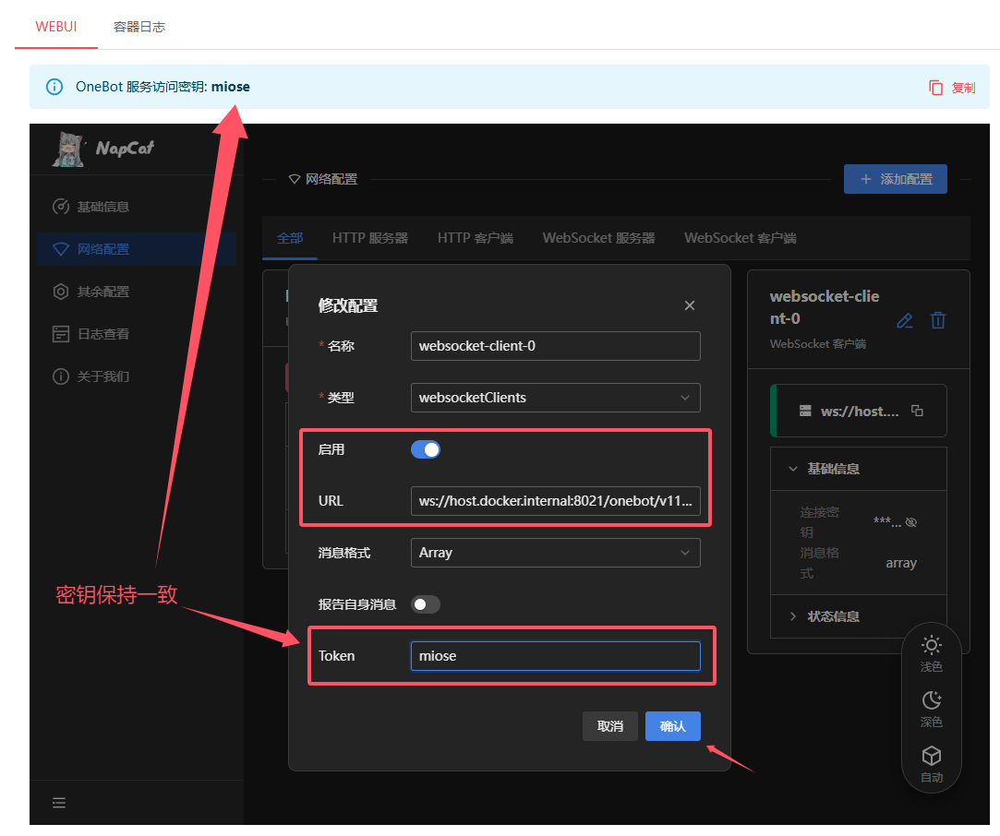

# Nekro Agent - 更智能、更优雅的代理执行 AI

<!-- markdownlint-disable MD033 MD041 -->

<div align="center">
  <a href="https://v2.nonebot.dev/store"></a><br>
  <p></p>
</div>
<div align="center">
  ✨ 高可扩展 | 高自由度 | 极简部署 的 AI 聊天插件 & 代理执行 Bot! ✨<br/>
  🎉 <a href="https://github.com/KroMiose/nonebot_plugin_naturel_gpt">Naturel GPT</a> 的 Agent 升级续作 🌈<br/>
  🧬 <a href="https://docs.google.com/spreadsheets/d/1JQNmVH-vlDn2uEPwkjv3iN-zn0PHpQ7RGbgA5T3fxOA/edit?usp=sharing">预设收集共享表(欢迎分享各种自定义人设)</a> 🧬 <br/>
  🎆 如果喜欢请点个⭐吧！您的支持就是我持续更新的动力 🎉<br/>
  💬 技术交流/答疑/讨论 -> ：<a href="https://jq.qq.com/?_wv=1027&k=71t9iCT7">加入插件交流群: 636925153</a> 🗨️ <br/>
  
  <a href="https://pypi.python.org/pypi/nekro-agent" target="_blank">
    
  </a>
  <a href="https://hub.docker.com/u/kromiose" target="_blank">
    
  </a>
  <a href="https://jq.qq.com/?_wv=1027&k=71t9iCT7" target="_blank">
    
  </a>
  <br/>
  📢 <a href="https://api.nekro.ai">Nekro 官方合作中转站</a> 现已上线，参与 Nekro 生态开发者有机会获得本站专属额度补贴！ 📢 <br/>
  🌟 可洛喵 & Nekro Agent 插件形象征集中，欢迎加入交流群分享你的创意！🌟<br/>
  🚀 <a href="https://community.nekro.ai">NekroAI 云社区</a> 已全新上线！支持插件和人设实时自由共享，生态观测功能等你体验！ 🚀<br/>
</div>

## 🚀 NekroAI 云社区

[NekroAI 云社区](https://community.nekro.ai) 已全新上线！这里提供插件和人设的实时自由共享与实时社区生态观测功能，快来体验吧~

## ⚠ !安全警告!

! 本项目运行时允许 AI 在独立 Docker 容器环境中执行任意代码，存在一定的安全风险，包括但不限于:

1. IP 地址泄漏
2. 容器逃逸
3. 其它未知风险

! 请知悉并自行承担风险，作者不对使用本项目造成的任何损失负责 !

## ⚙️ 效果演示

> `[Debug]` 前缀的消息为调试信息，默认关闭输出


## 💡 功能列表

> 以下未勾选功能仅表示未来可能开发的方向，不代表实际进度，具体开发事项可能随时变动
> 勾选: 已实现功能；未勾选: 正在开发 / 计划开发 / 待定设计

- [x] 群聊/私聊 场景的上下文智能聊天
- [x] 自定义人设与人设市场
- [x] 容器化沙盒执行环境
- [x] 图片资源交互 (支持 Bot 发送&接收&处理 图片资源)
- [x] 高度可扩展的插件系统与插件市场
- [x] 基于 `docker-compose` 的容器编排一键部署支持 | 一键化小白无障碍部署脚本
- [x] 更多文件资源交互 (文件/视频/音频等，可直接通过群文件/私聊 发送&接收&处理 任意文件资源)
- [x] 配置热更新与指令控制支持
- [x] 原生多模态理解支持 (支持通用图片理解能力)
- [x] 可视化应用管理控制面板 (WebUI 支持)
- [x] 外置思维链 (CoT) 能力支持 (需要手动开启，推荐未原生支持 CoT 的模型搭配使用)
- [x] 定时器自触发插件与节日祝福 (允许 AI 在一定条件下唤醒自身回复)
- [x] 更多事件通知理解上下文理解
- [x] 完善第三方插件能力及 AI 生成插件
- [ ] 动态复杂人设扩展能力
- [ ] 基于 LLM 的自动上下文衔接触发器

## 🎁 部署指南

本插件提供多种部署方式，选择一种部署方式并在部署完毕后补充配置信息即可正常工作

### 😿 方式一: NekroAgent & Napcat 一键部署脚本 (**推荐**)

> 该安装方式为集成 Napcat 协议端的自动化部署版本，一行命令即可快速拉起完整服务

#### 运行一键安装脚本

> 默认安装目录为 `~/srv/nekro_agent`，如果需要修改，请在脚本执行前执行 `export NEKRO_DATA_DIR=<你的目录>` 设置环境变量

```bash
sudo -E bash -c "$(curl -fsSL https://raw.githubusercontent.com/KroMiose/nekro-agent/main/docker/quick_start_x_napcat.sh)"
```

根据终端引导进行操作，安装完成后可以访问 NekroAgent 的 WebUI 界面:


注意: 如果您使用的是云服务器，请确保服务器后台放行以下端口:

- 8021 端口 (NekroAgent 主服务端口)
- 6099 端口 (Napcat 端口)

随后访问 `http://<你的服务ip>:8021` 使用安装脚本提供的管理员账号密码登录 NekroAgent 的 WebUI 界面

#### 配置协议端

在 `系统配置` -> `基本配置` 中配置 `NapCat WebUI 访问地址` 为 `http://<你的服务ip>:6099/webui` 并点击保存配置

在 `协议端` -> `NapCat` -> `容器日志` 选项卡中获取 NapCat WebUI 的登录 Token

在 `协议端` -> `NapCat` -> `WebUI` 选项卡中输入 Token 登录，选择 QrCode 登录方式，扫描二维码登录

进入 `网络配置` 选项卡中切换选择 `添加配置` 选择 `Websocket 客户端` 类型，按照下图填写反向代理地址

```plaintext
ws://nekro_agent:8021/onebot/v11/ws
```



名称可任意填写并确认即可连接 Bot 账号

### 🚀 方式二: NekroAgent 一键部署脚本 (不含协议端)

该安装方式仅包含 NekroAgent 本体和必要运行组件，需要使用任意 OneBot V11 协议实现端连接即可工作

> 默认安装目录为 `~/srv/nekro_agent`，如果需要修改，请在脚本执行前执行 `export NEKRO_DATA_DIR=<你的目录>` 设置环境变量

```bash
sudo -E bash -c "$(curl -fsSL https://raw.githubusercontent.com/KroMiose/nekro-agent/main/docker/quick_start.sh)"
```

使用任意 OneBot V11 协议端连接: `ws://<你的服务ip>:8021/onebot/v11/ws`

## 🆙 更新应用

当 NekroAgent 新版本发布时，你可以使用以下一键命令更新应用

```bash
# 设置数据目录
export NEKRO_DATA_DIR=${HOME}/srv/nekro_agent
# 更新 `nekro-agent` 镜像并重启容器
cd ${NEKRO_DATA_DIR} && \
 sudo docker-compose --env-file .env pull && \
 sudo docker-compose --env-file .env down && \
 sudo docker-compose --env-file .env up --build -d
```

## 🔨 基本命令

> 命令系统尚在完善中，目前仅提供了一些基础命令，所有命令均需要 Bot 管理员权限(不是群管理员) 才能使用

命令的默认指令前缀为 `/`

|   指令   |  权限  |     说明     |
| :------: | :----: | :----------: |
| /na_help | 管理员 | 查询应用命令 |

注: `<chat_key?>` 为会话的唯一标识符，格式为 `group_群号` `private_QQ号`

## 📖 常见问题

#### Q: 为什么我的机器人无法发送 文字/图片 以外的文件内容？

A: 请检查你的协议实现端是否支持文件发送，如果支持，请继续

由于 OneBot V11 协议的限制，发送文件时需要协议端能够直接访问到该文件的路径，因此你需要根据实际部署情况为 NekroAgent 配置文件访问基准路径，以下是一个示例:

假设你的协议端部署在容器中，你需要先挂载 NekroAgent 的数据目录到协议端容器中，即 `${HOME}/srv/nekro_agent:/app/nekro_agent_data`，然后为 NekroAgent 配置文件访问基准路径:

```yaml
SANDBOX_ONEBOT_SERVER_MOUNT_DIR: "/app/nekro_agent_data"
```

这样 NekroAgent 就可以访问到协议实现端的数据目录，从而发送文件内容了

#### Q: 如何在同一设备上部署多个 NekroAgent 实例？

A: 请先使用 `export NEKRO_DATA_DIR=<你的目录>` 设定好不冲突的目录，然后运行安装脚本并按提示修改 `.env` 文件，设定合适的前缀以避免容器名冲突，设定合适的端口以避免端口冲突，继续完成部署即可

## 🖥️ 开发指南

如果你想为 NekroAgent 项目贡献，或者想在 NekroAgent 实现基础上定制自己的功能，请参考 [开发指南](./docs/README_Advanced.md)

## 🤝 贡献列表

感谢以下开发者对本项目做出的贡献

<a href="https://github.com/KroMiose/nekro-agent/graphs/contributors">
  
</a>

## 🎉 更新日志

前往 [Release 页面](https://github.com/KroMiose/nekro-agent/releases) 查看重要更新日志

## ⭐ Star 历史

[](https://star-history.com/#KroMiose/nekro-agent&Date)

## 📚 文档

- [开发指南](docs/README_Advanced.md) - 详细的部署和开发说明
- [扩展开发指南](docs/Extension_Development.md) - 完整的扩展开发文档和 API 参考
- [配置说明](nekro_agent/core/config.py) - 配置项说明文档
