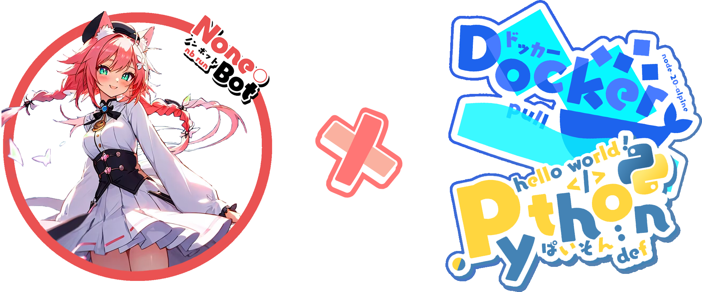
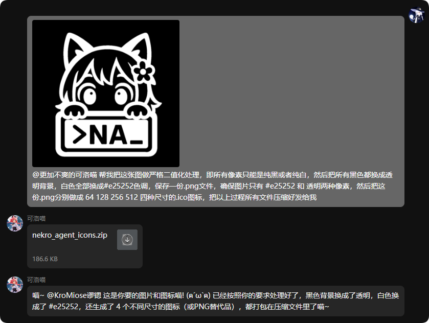

# Nekro Agent - 更智能、更优雅的代理执行 AI

<!-- markdownlint-disable MD033 MD041 -->

<div align="center">
  <a href="https://doc.nekro.ai"></a><br>
  <p></p>
</div>

<div align="center">
  ✨ 高可扩展 | 高自由度 | 极简部署 的 AI 聊天 & 代理执行 Bot! ✨<br/>
    
  <a href="https://pypi.python.org/pypi/nekro-agent" target="_blank">
    
  </a>
  <a href="https://hub.docker.com/u/kromiose" target="_blank">
    
  </a>
  <a href="https://qm.qq.com/q/eT30LxDcSA" target="_blank">
    
  </a>
  <br/>
  🚅 源自首批大模型应用 <a href="https://github.com/KroMiose/nonebot_plugin_naturel_gpt">Naturel GPT</a> 的 Agent 升级重构续作 🌈<br/>
  📚 <a href="https://doc.nekro.ai">Nekro Agent 文档中心</a> 提供完整的入门指南与开发文档 📚<br/>
  💬 技术交流/答疑/讨论：<a href="https://qm.qq.com/q/eT30LxDcSA">加入社区交流群: 636925153</a> 🗨️ <br/>
  🚀 <a href="https://community.nekro.ai">NekroAI 云社区</a> 提供插件和人设实时自由共享，生态观测功能等你体验！ 🚀<br/>
</div>

## 🚀 核心能力

NekroAgent 通过强大灵活的提示词构建系统，引导 AI 生成准确的代码并在沙盒中执行，通过 RPC 通信来与真实环境交互。主要特点包括：

- 安全的容器化 **沙盒执行环境**，内置完整的 Python 运行时环境
- 强大的代码 **引导、生成、纠错、执行** 能力，支持图表生成、通用内容处理等复杂任务
- 原生多模态 **视觉理解与交互** 支持，可处理图片、文件等多种资源
- 高度可扩展的 **插件系统**，提供多种关键节点回调、提示词注入、自定义沙盒方法
- 原生的 **多人场景互动** 支持，高效洞悉群聊场景需求
- 云端实时资源共享服务，包括插件、人设等，强大友好的 **社区驱动** 能力
- 功能齐全的 **可视化界面** 应用管理面板
- 拒绝无效提示词与滥用迭代智能体，复杂任务的极致 **降本增效** 实践
- 基于 **事件驱动** 的交互架构，遵循异步优先的高效响应机制

## ⚙️ 效果演示



## 🎨 应用场景

Nekro Agent 提供多样化的应用场景，从情感陪伴到复杂任务处理，满足各类需求：

- 💖 **情感交互与陪伴**：通过灵活的人设系统和先进的大语言模型，提供自然流畅的情感互动体验，支持多种角色定制和可扩展的记忆能力
- 📊 **数据与文件处理**：高效处理各类图像、文档及数据，无需额外软件支持，轻松完成格式转换与内容提取
- 🎮 **创意与开发辅助**：从网页应用生成到数据可视化，让创意实现变得简单高效
- 🔄 **自动化与集成**：支持事件订阅推送和多 AI 协作，实现复杂任务的智能自动化
- 📚 **学习与生活助手**：从学习辅导到内容创作，再到智能家居控制，全方位提升生活品质

👉 更多精彩用例与演示，请访问[应用场景展示页面](https://doc.nekro.ai/docs/01_intro/application_scenarios)！

## 💡 功能列表

- ✅ 群聊/私聊 场景的上下文智能聊天
- ✅ 自定义人设与人设市场
- ✅ 容器化沙盒执行环境
- ✅ 图片资源交互 (支持 Bot 发送&接收&处理 图片资源)
- ✅ 高度可扩展的插件系统与插件市场
- ✅ 基于 `docker-compose` 的容器编排一键部署支持
- ✅ 更多文件资源交互 (文件/视频/音频等)
- ✅ 配置热更新与指令控制支持
- ✅ 原生多模态理解支持 (支持通用图片理解能力)
- ✅ 可视化应用管理控制面板 (WebUI 支持)
- ✅ 外置思维链 (CoT) 能力支持
- ✅ 定时器自触发插件与节日祝福
- ✅ 更多事件通知理解上下文理解
- ✅ 完善第三方插件能力及 AI 生成插件

## 🎁 快速部署

我们提供了多种部署方式，请访问 [快速开始文档](https://doc.nekro.ai/docs/02_quick_start/quickstart) 查看详细教程：

- [Linux 部署教程](https://doc.nekro.ai/docs/02_quick_start/deploy/linux)
- [Windows 部署教程](https://doc.nekro.ai/docs/02_quick_start/deploy/windows)
- [MacOS 部署教程](https://doc.nekro.ai/docs/02_quick_start/deploy/macos)

### 一键部署脚本 (推荐)

```bash
sudo -E bash -c "$(curl -fsSL https://raw.githubusercontent.com/KroMiose/nekro-agent/main/docker/quick_start_x_napcat.sh)"
```

## 🖥️ 开发者资源

如果你想为 NekroAgent 项目贡献，或想在 NekroAgent 基础上定制自己的功能，请参考：

- [插件开发指南(施工中)](https://doc.nekro.ai/docs/04_plugin_dev/01_concepts/architecture)
- [应用开发指南](https://doc.nekro.ai/docs/05_app_dev/dev_linux)

注意：贡献代码前请先阅读[许可说明](./LICENSE)中的条款，贡献代码即表示您同意这些条款。

## 📖 常见问题

常见问题及解答请访问 [故障排除与 FAQ](https://doc.nekro.ai/docs/06_troubleshooting/faq)

## 🎉 更新日志

前往 [Release 页面](https://github.com/KroMiose/nekro-agent/releases) 查看重要更新日志

## 📜 许可说明

NekroAgent 采用 [自定义的开源协议](./LICENSE)（基于 Apache License 2.0 修改）进行分发。请在遵守协议的前提下使用本项目！

## 🤝 贡献列表

感谢以下开发者对本项目做出的贡献

<a href="https://github.com/KroMiose/nekro-agent/graphs/contributors">
  
</a>

## ⭐ Star 历史


