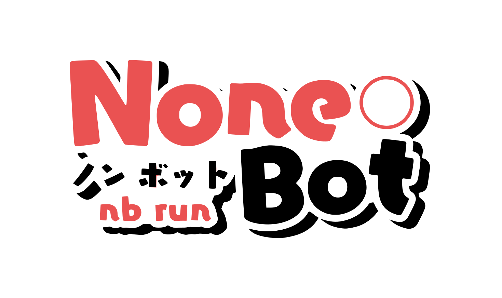

# Nekro Agent - 更智能、更优雅的代理执行 AI

Switch to [English](./README_en.md)

<!-- markdownlint-disable MD033 MD041 -->

<div align="center">
  <a href="https://doc.nekro.ai"></a><br>
  <p></p>
</div>

<div align="center">
  ✨ 高可扩展 | 高自由度 | 极简部署 的 AI 聊天 & 代理执行 Bot! ✨<br/>
    
  <a href="https://pypi.python.org/pypi/nekro-agent" target="_blank">
    
  </a>
  <a href="https://hub.docker.com/u/kromiose" target="_blank">
    
  </a>
  <a href="https://discord.gg/awuETjEJjA" target="_blank">
    
  </a>
  <a href="https://qm.qq.com/q/eT30LxDcSA" target="_blank">
    
  </a>
  <br/>
  🚅 源自首批大模型应用 <a href="https://github.com/KroMiose/nonebot_plugin_naturel_gpt">Naturel GPT</a> 的 Agent 升级重构续作 🌈<br/>
  📚 <a href="https://doc.nekro.ai">Nekro Agent 文档中心</a> 提供完整的入门指南与开发文档 📚<br/>
  💬 技术交流/答疑/讨论：<a href="https://qm.qq.com/q/eT30LxDcSA">加入社区交流群: 636925153</a> | <a href="https://discord.gg/awuETjEJjA">Discord Channel</a> 🗨️ <br/>
  🚀 <a href="https://community.nekro.ai">NekroAI 云社区</a> 提供插件和人设实时自由共享，生态观测功能等你体验！ 🚀<br/>
</div>

## 💬 社区与贡献

我们很高兴地宣布，我们正在计划进行国际化改造，以更好地支持我们的全球社区。我们欢迎来自世界各地的开发者加入我们的行列。

来我们的官方 Discord 服务器上与我们聊天，分享您的想法，成为 Nekro Agent 未来的重要一员！

- **加入我们的 Discord:** [https://discord.gg/awuETjEJjA](https://discord.gg/awuETjEJjA)

## 🚀 核心能力

NekroAgent 通过强大灵活的提示词构建系统，引导 AI 生成准确的代码并在沙盒中执行，通过 RPC 通信来与真实环境交互。主要特点包括：

**核心执行与扩展能力:**

- **代码生成与安全沙盒**：引导 AI 生成代码并在安全的容器化环境中执行，实现复杂任务与方法级扩展性的坚固基石！
- **高度可扩展的插件系统**：提供多种关键节点回调、提示词注入、自定义沙盒方法，从小型工具扩展到大型系统优雅集成的超智能中枢解决方案！
- **原生多人场景互动**：高效洞悉群聊场景需求，在复杂的多人对话中保持交互能力！
- **极致的降本增效**：拒绝无效提示词与滥用迭代智能体，聚焦解决问题的逻辑根本。
- **自动纠错与反馈**：深耕提示词纠错与反馈机制，打破困于错误与重复的循环。

**连接与交互:**

- **多平台适配器架构**：原生支持 `OneBot v11`, `Minecraft`, `B站直播` 等多种聊天平台，提供统一的开发接口。
- **原生多模态视觉理解**：可处理图片、文件等多种资源，与用户进行多模态交互。
- **基于事件驱动的异步架构**：遵循异步优先的高效响应机制。

**生态与易用性:**

- **云端资源共享**：包括插件、人设等，拥有强大友好的社区驱动能力。
- **功能齐全的可视化界面**：提供强大的应用管理与监控面板。

## 🏛️ 架构概览

Nekro Agent 的核心是面向 **输入/输出流** 设计的。适配器（Adapter）作为连接外部平台的桥梁，仅需实现对具体平台消息的接收（输入流）和发送（输出流）。所有复杂的业务逻辑，如会话管理、插件执行、沙盒调用等，都由 Nekro Agent 的核心引擎自动接管和处理。这种设计确保了极高的扩展性和维护性，让开发者可以专注于实现适配器本身的功能，而无需关心核心的复杂实现。


## ⚙️ 效果演示

Nekro Agent 提供了强大而直观的可视化界面，方便您管理和监控 Agent 的所有行为，以及实现多种精细化的 Agent 行为策略控制等。


## 🎨 应用场景

Nekro Agent 提供多样化的应用场景，从情感陪伴到复杂任务处理，满足各类需求：

- 💖 **情感交互与陪伴**：通过灵活的人设系统和先进的大语言模型，提供自然流畅的情感互动体验，支持多种角色定制和可扩展的记忆能力
- 📊 **数据与文件处理**：高效处理各类图像、文档及数据，无需额外软件支持，轻松完成格式转换与内容提取
- 🎮 **创意与开发辅助**：从网页应用生成到数据可视化，让创意实现变得简单高效
- 🔄 **自动化与集成**：支持事件订阅推送和多 AI 协作，实现复杂任务的智能自动化
- 📚 **学习与生活助手**：从学习辅导到内容创作，再到智能家居控制，全方位提升生活品质

👉 更多精彩用例与演示，请访问[应用场景展示页面](https://doc.nekro.ai/docs/01_intro/application_scenarios)！

## 💡 功能列表

- ✅ **多平台适配**：
  - ✅ OneBot v11 (QQ)
  - ✅ Discord
  - ✅ Minecraft
  - ✅ Bilibili Live (B 站直播)
  - ✅ SSE+SDK (Server-Sent Events + SDK)
  - ✅ ... 更多适配器开发中
- ✅ **智能聊天**：群聊/私聊场景下的上下文智能聊天
- ✅ **自定义人设**：支持自定义人设与云端人设市场
- ✅ **沙盒执行**：安全的容器化代码执行环境
- ✅ **多模态交互**：支持发送、接收和处理图片及文件资源
- ✅ **插件生态**：高度可扩展的插件系统与云端插件市场
- ✅ **一键部署**：基于 `docker-compose` 的容器编排一键部署
- ✅ **热重载**：配置热更新与指令控制支持
- ✅ **定时任务**：支持定时自触发插件与节日祝福
- ✅ **WebUI**：功能齐全的可视化应用管理控制面板
- ✅ **事件支持**：可响应多种平台事件通知并理解其上下文
- ✅ 外置思维链 (CoT) 能力支持
- ✅ 完善第三方插件能力及 AI 生成插件

## 🎁 快速部署

我们提供了多种部署方式，请访问 [快速开始文档](https://doc.nekro.ai/docs/02_quick_start/quickstart) 查看详细教程：

- [Linux 部署教程](https://doc.nekro.ai/docs/02_quick_start/deploy/linux)
- [Windows 部署教程](https://doc.nekro.ai/docs/02_quick_start/deploy/windows)
- [MacOS 部署教程](https://doc.nekro.ai/docs/02_quick_start/deploy/macos)

### 一键部署脚本 (推荐)

#### 从 Github (推荐)
```bash
sudo -E bash -c "$(curl -fsSL https://raw.githubusercontent.com/KroMiose/nekro-agent/main/docker/install.sh)" - --with-napcat
```
如果从 Github 下载脚本遇到网络问题，您可以使用国内的 GitCode 镜像源：

#### 从 GitCode (国内加速)
```bash
sudo -E bash -c "$(curl -fsSL https://raw.gitcode.com/gh_mirrors/ne/nekro-agent/raw/main/docker/install.sh)" - --with-napcat
```
提示:

上述命令中的 --with-napcat 参数会启动全自动标准部署。
如果不加此参数，脚本会以交互模式启动，届时请选择 Y 以安装 Napcat。

## 🖥️ 开发者资源

我们欢迎所有开发者为 Nekro Agent 社区贡献代码或想法！

- [插件开发指南(施工中)](https://doc.nekro.ai/docs/04_plugin_dev/01_concepts/architecture)
- [应用开发指南](https://doc.nekro.ai/docs/05_app_dev/dev_linux)
- [项目架构解析](https://deepwiki.com/KroMiose/nekro-agent)[](https://deepwiki.com/KroMiose/nekro-agent)

注意：贡献代码前请先阅读[许可说明](./LICENSE)中的条款，贡献代码即表示您同意这些条款。

## 📖 常见问题

常见问题及解答请访问 [故障排除与 FAQ](https://doc.nekro.ai/docs/06_troubleshooting/faq)

## 🎉 更新日志

前往 [Release 页面](https://github.com/KroMiose/nekro-agent/releases) 查看重要更新日志

## 📜 许可说明

NekroAgent 采用 [自定义的开源协议](./LICENSE)（基于 Apache License 2.0 修改）进行分发。请在遵守协议的前提下使用本项目！

## 🤝 贡献列表

感谢以下开发者对本项目做出的贡献

<a href="https://github.com/KroMiose/nekro-agent/graphs/contributors">
  
</a>

## ⭐ Star 历史


