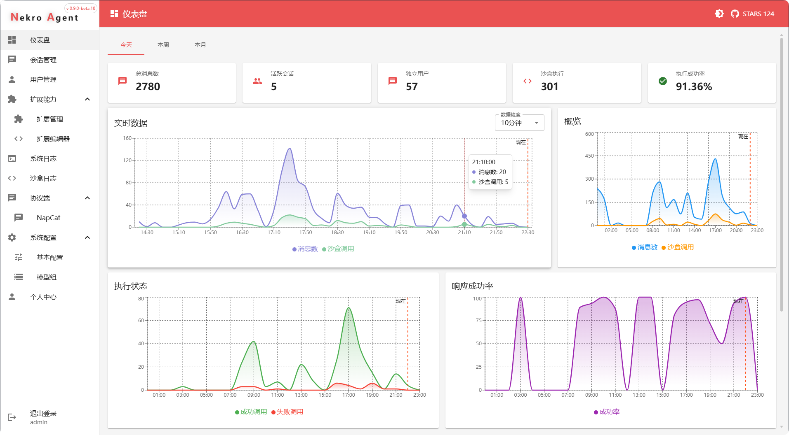

# Nekro Agent - A Smarter, More Elegant Agent Execution AI

转到 [简体中文](./README.md)

<!-- markdownlint-disable MD033 MD041 -->

<div align="center">
  <a href="https://doc.nekro.ai"></a><br>
  <p></p>
</div>

<div align="center">
  ✨ Highly Extensible | High Freedom | Minimalist Deployment AI Chat & Agent Execution Bot! ✨<br/>
    
  <a href="https://pypi.python.org/pypi/nekro-agent" target="_blank">
    
  </a>
  <a href="https://hub.docker.com/u/kromiose" target="_blank">
    
  </a>
  <a href="https://wakatime.com/badge/github/KroMiose/nekro-agent" target="_blank">
    
  </a>
  <a href="https://discord.gg/eMsgwFnxUB" target="_blank">
    
  </a>
  <a href="https://qm.qq.com/q/eT30LxDcSA" target="_blank">
    
  </a>
  <br/>
  🚅 An upgraded and refactored Agent sequel, originating from one of the first major LLM applications, <a href="https://github.com/KroMiose/nonebot_plugin_naturel_gpt">Naturel GPT</a> 🌈<br/>
  📚 <a href="https://doc.nekro.ai">Nekro Agent Doc Center</a> provides complete getting started guides and development documentation (Chinese) 📚<br/>
  💬 For technical discussions and Q&A, join our <a href="https://discord.gg/eMsgwFnxUB">Official Discord Server</a>! 🗨️ <br/>
  🚀 <a href="https://community.nekro.ai">NekroAI Cloud Community</a> offers real-time sharing of plugins and personas! (Chinese) 🚀<br/>
</div>

## 💬 Community & Contribution

We are excited to announce that we are planning an internationalization refactor to better support our global community. We welcome developers from all over the world to join us in this effort.

Come and chat with us on our official Discord server, share your ideas, and be a part of Nekro Agent's future!

- **Join our Discord:** [https://discord.gg/eMsgwFnxUB](https://discord.gg/eMsgwFnxUB)

## 🚀 Core Capabilities

NekroAgent uses a powerful and flexible prompt construction system to guide the AI in generating accurate code, which is then executed in a sandbox environment, interacting with the real world via RPC communication. Key features include:

**Core Execution & Extensibility:**

- **Code Generation & Secure Sandbox**: Guides AI to generate code and execute it in a secure, containerized environment, forming a solid foundation for complex tasks and method-level extensibility.
- **Highly Extensible Plugin System**: Provides various key node callbacks, prompt injections, and custom sandbox methods, creating an ultra-intelligent hub for solutions ranging from small tools to large-scale system integrations.
- **Native Multi-person Interaction**: Efficiently understands group chat dynamics and maintains interaction capabilities in complex multi-person conversations.
- **Ultimate Cost & Efficiency Optimization**: Rejects ineffective prompts and abusive iterative agents, focusing on the logical root of problem-solving.
- **Automatic Error Correction & Feedback**: Deeply cultivates prompt error correction and feedback mechanisms, breaking the cycle of errors and repetition.

**Connectivity & Interaction:**

- **Multi-platform Adapter Architecture**: Natively supports various chat platforms like `OneBot v11` (QQ), `Discord`, `Telegram`, `Minecraft`, `Bilibili Live`, `WeChat`, `Email`, and `SSE+SDK`, providing a unified development interface.
- **Native Multimodal Vision Understanding**: Can process various resources like images and files for multimodal interaction with users.
- **Event-driven Asynchronous Architecture**: Follows an async-first principle for efficient responsiveness.

**Ecosystem & Usability:**

- **Cloud Resource Sharing**: Includes plugins, personas, and more, driven by a strong and friendly community.
- **Full-featured Visual Interface**: Offers a powerful application management and monitoring dashboard.

## 🏛️ Architecture Overview

The core of Nekro Agent is designed around **input/output streams**. Adapters act as bridges to external platforms, only needing to implement message reception (input stream) and sending (output stream) for a specific platform. All complex business logic, such as session management, plugin execution, and sandbox calls, is automatically handled by the Nekro Agent core engine. This design ensures high extensibility and maintainability, allowing developers to focus on the adapter's functionality without worrying about the complex core implementation.


## ⚙️ Demo

Nekro Agent provides a powerful and intuitive visual interface for managing and monitoring all agent behaviors, as well as implementing various fine-grained agent behavior control strategies.




## 🎨 Application Scenarios

Nekro Agent offers a variety of application scenarios, from emotional companionship to complex task processing, meeting all kinds of needs:

- 💖 **Emotional Interaction & Companionship**: Provides a natural and smooth emotional interaction experience through a flexible persona system and advanced large language models, supporting various character customizations and expandable memory capabilities.
- 📊 **Data & File Processing**: Efficiently handles various images, documents, and data without additional software, easily completing format conversion and content extraction.
- 🎮 **Creative & Development Assistance**: Makes creative implementation simple and efficient, from web application generation to data visualization.
- 🔄 **Automation & Integration**: Supports event subscription pushes and multi-AI collaboration, achieving intelligent automation of complex tasks.
- 📚 **Study & Life Assistant**: Comprehensively improves quality of life, from academic tutoring and content creation to smart home control.

👉 For more exciting use cases and demos, please visit the [Application Scenarios page (Chinese)](https://doc.nekro.ai/docs/01_intro/application_scenarios)!

## 💡 Features

- ✅ **Multi-platform Support**:
  - ✅ OneBot v11 (QQ)
  - ✅ Discord
  - ✅ Telegram
  - ✅ Minecraft
  - ✅ Bilibili Live
  - ✅ WeChat (via WeChatPad)
  - ✅ Email (SMTP/IMAP)
  - ✅ SSE+SDK (Server-Sent Events + SDK)
  - ✅ ... more adapters in development
- ✅ **Intelligent Chat**: Context-aware intelligent chat in group/private scenarios.
- ✅ **Custom Personas**: Supports custom personas and a cloud-based persona marketplace.
- ✅ **Sandbox Execution**: Secure, containerized code execution environment.
- ✅ **Multimodal Interaction**: Supports sending, receiving, and processing images and file resources.
- ✅ **Plugin Ecosystem**: Highly extensible plugin system and a cloud-based plugin marketplace.
- ✅ **One-click Deployment**: Container orchestration based on `docker-compose` for one-click deployment.
- ✅ **Hot Reloading**: Supports configuration hot-swapping and command-based control.
- ✅ **Scheduled Tasks**: Supports scheduled, self-triggering plugins and holiday greetings.
- ✅ **WebUI**: A full-featured visual application management and control panel.
- ✅ **Event Support**: Can respond to various platform event notifications and understand their context.
- ✅ External Chain of Thought (CoT) capability support.
- ✅ Comprehensive third-party plugin capabilities and AI-generated plugins.

## 🎁 Quick Deployment

We offer multiple deployment methods. Please visit the [Quick Start Guide (Chinese)](https://doc.nekro.ai/docs/02_quick_start/quickstart) for detailed tutorials.

### One-click Deployment Script (Recommended)

#### From Github (Recommended)

```bash
sudo -E bash -c "$(curl -fsSL https://raw.githubusercontent.com/KroMiose/nekro-agent/main/docker/install.sh)" - --with-napcat
```

If you encounter network issues downloading the script from Github, you can use the Nekro Endpoint's edge proxy access address:

#### From [NekroEndpoint](https://ep.nekro.ai) (Cloudflare Edge Proxy Access)

```bash
sudo -E bash -c "$(curl -fsSL https://ep.nekro.ai/e/KroMiose/nekro-agent/main/docker/install.sh)" - --with-napcat
```

Note: The `--with-napcat` parameter enables fully automatic standard deployment. Without this parameter, the script will start in interactive mode, where you can choose to install Napcat.

### Docker Image Information

Nekro Agent provides two Docker image tags, published to both **Docker Hub** and **GitHub Container Registry (GHCR)**:

- **latest**: Stable version, released based on tags, suitable for production environments
- **preview**: Preview version, automatically built on every main branch update, includes latest features, suitable for testing and development

#### Pull from Docker Hub (Recommended)

```bash
# Use stable version (recommended)
docker pull kromiose/nekro-agent:latest

# Use preview version (experience latest features)
docker pull kromiose/nekro-agent:preview
```

#### Pull from GitHub Container Registry

```bash
# Use stable version
docker pull ghcr.io/kromiose/nekro-agent:latest

# Use preview version
docker pull ghcr.io/kromiose/nekro-agent:preview
```

## 🖥️ Developer Resources

We welcome all developers to contribute code or ideas to the Nekro Agent community!

- [Plugin Development Guide (WIP)](https://doc.nekro.ai/docs/04_plugin_dev/01_concepts/architecture) (Chinese)
- [Application Development Guide](https://doc.nekro.ai/docs/05_app_dev/dev_linux) (Chinese)
- [Project Architecture Analysis](https://deepwiki.com/KroMiose/nekro-agent)[](https://deepwiki.com/KroMiose/nekro-agent)

Note: Please read the terms in the [License](./LICENSE) before contributing code. By contributing, you agree to these terms.

## 📖 FAQ

For frequently asked questions and answers, please visit [Troubleshooting & FAQ (Chinese)](https://doc.nekro.ai/docs/06_troubleshooting/faq)

## 🎉 Changelog

Go to the [Releases Page](https://github.com/KroMiose/nekro-agent/releases) to see important update logs.

## 📜 License

NekroAgent is distributed under a [custom open-source license](./LICENSE) (modified from Apache License 2.0). Please use this project in compliance with the license terms!

## 🤝 Contributors

Thanks to the following developers for their contributions to this project.

<a href="https://github.com/KroMiose/nekro-agent/graphs/contributors">
  
</a>

## ⭐ Star History


